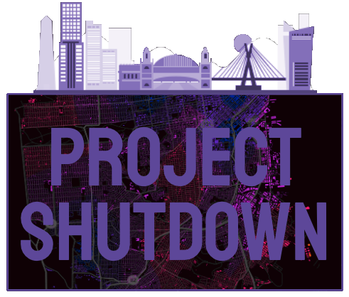

# Group 5 Project Shutdown Proposal

Many major cities have been hit hard from COVID, resulting in many issues that no major city was prepared for. In the wake of this mess, it has been reported that a significant amount of businesses have been shut down; most notably San Francisco. In our project, we will be analyzing the potential impact particularly on registered business across San Francisco. 

With the information provided by data.sfgov, we will find out the business start and end date (registered to unregistered), business location move out (location start date vs end date), the category in which businesses have been affected using NAICS code description (eg. 5300-5399 -Real Estate and Rental; 4400-4599 -Retail Trade; etc.), the neighborhoods most affected (eg. Mission District, Chinatown, Financial District etc.). This will be a 4 year range we will analyze, from 2017 until 2021.

Registered vs Unregistered
With this information, we can have a map displaying business still registered and unregistered containing pinpoint markers (eg. blue registered, red unregistered), and may brainstorm some other possible mapping methods. We will also have a line graph displaying our results.

Location Start Date vs End Date
While similar to the registration format, many businesses are still registered but moved locations in our out of SF which is just as important to note. The formatting will be similar as above.

Business Categories
In our dataset, we are also provided with the NAICS code to display the type of business that is registered. We can map out markers either colored or having a symbol displaying the type of business, and refer back to the Location and Registered criteria to see which type of businesses have been impacted the most. In addition to the map, we can display a bar chart to show the difference.

Neighborhoods Affected
SF is extremely diverse and varies from every neighborhood. Chinatown is far different than the Financial or Mission District, so we can have a map that sections off based on the neighborhood. This will clarify which neighborhoods have been the most impacted using a similar format to Business Categories; with mapping markers based on the neighborhood, including colored tiles displaying the neighborhoods. This will also include a bar graph.
 

Datasets/Resources:
SF Registered Business Locations 

Inspiration

Technologies
JavaScript (Leaflet, D3, Plotly, React.js)
Python to create API
CSS
HTML
Bootstrap
=======

>>>>>>> ff97b73059901e422935b621f62247f8a5535525
