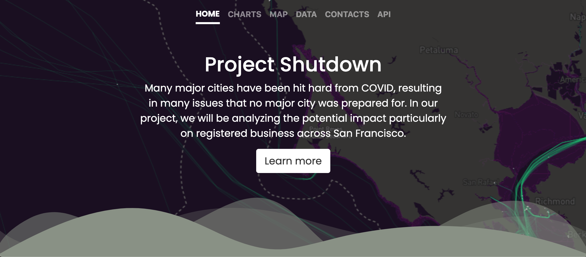
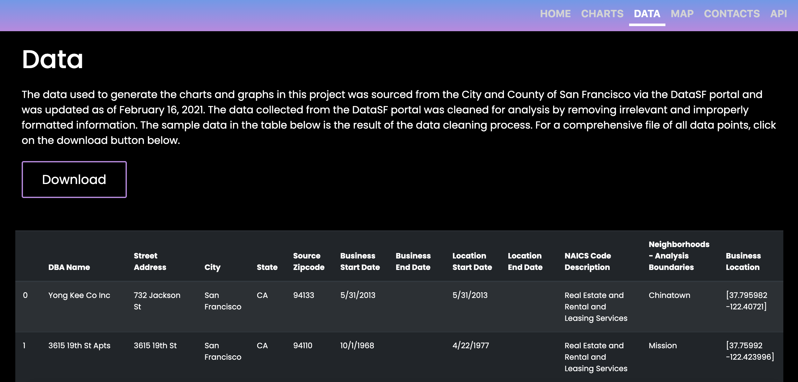
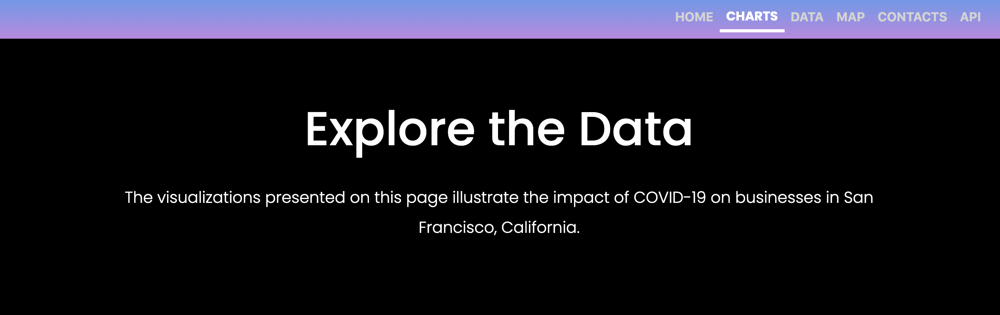
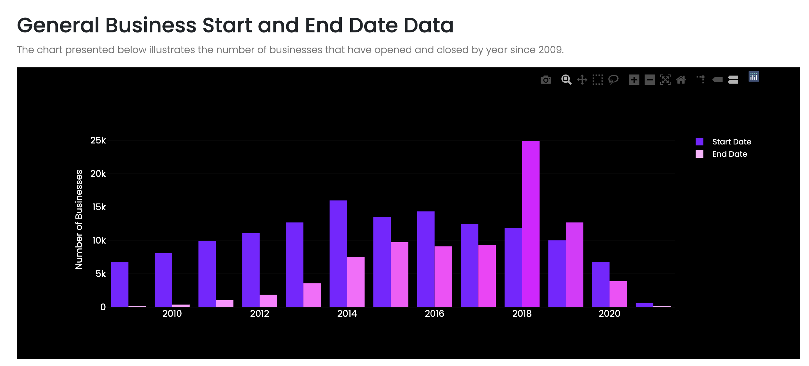
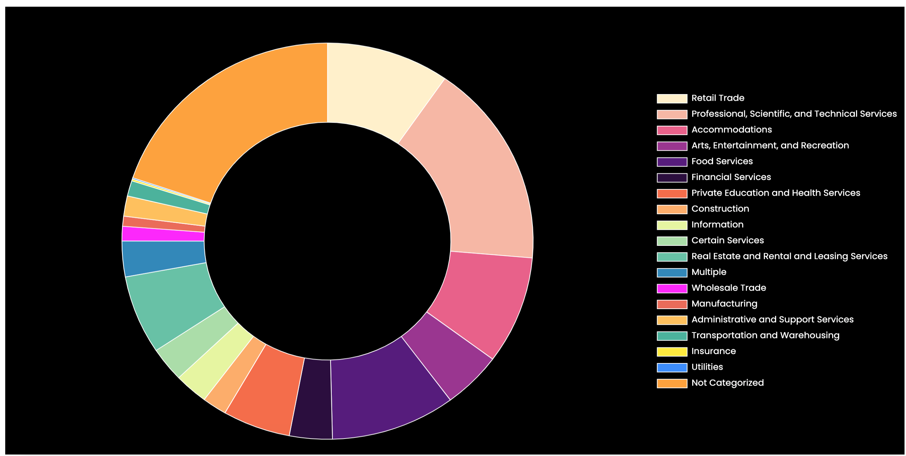
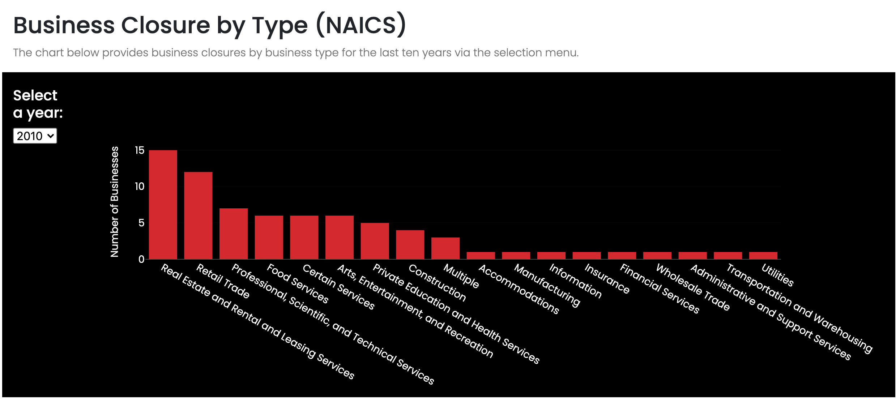
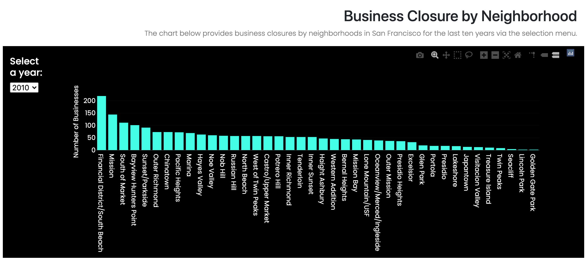
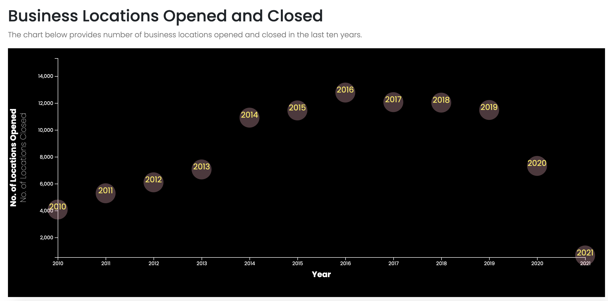
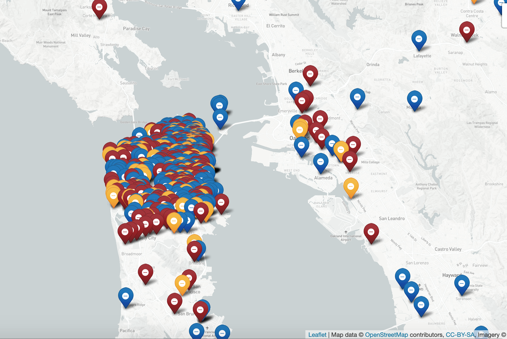

# Group 5 Project Shutdown Proposal

* [Introduction](#introduction)
* [Registered vs Unregistered](#registered-vs-unregistered)
* [Business Categories](#Business-Categories)
* [Neighborhoods Affected](#Neighborhoods-Affected)
* [Datasets/Resources](#Datasets/Resources)
* [Technologies](#Technologies)
* [Our Process](#Our-Process)
* [Findings](#findings)
* [Improvements and Future Plans](#Improvements-and-Future-Plans)
* [Conclusion](#conclusion)
* [Running the application](#Running-the-application)
* [Snippets of our web application](#Snippets-of-our-web-application)

## **Introduction**
Many major cities have been hit hard from COVID, resulting in issues that no major city was prepared for. In the wake of this mess, it has been reported that a significant amount of businesses have been shut down; most notably San Francisco. In our project, we will be analyzing the potential impact particularly on registered business across San Francisco. 

With the information provided by data.sfgov, we will find out the business start and end date (registered to unregistered), business location move out (location start date vs end date), the category in which businesses have been affected using NAICS code description (eg. 5300-5399 -Real Estate and Rental; 4400-4599 -Retail Trade; etc.), the neighborhoods most affected (eg. Mission District, Chinatown, Financial District etc.). This will be a 4 year range we will analyze, from 2017 until 2021. 

## **Registered vs Unregistered**
With this information, we can have a map displaying business still registered and unregistered containing pinpoint markers (eg. blue registered, red unregistered), and may brainstorm some other possible mapping methods. We will also have a line graph displaying our results.

Location Start Date vs End Date
While similar to the registration format, many businesses are still registered but moved locations in our out of SF which is just as important to note. The formatting will be similar as above.

## **Business Categories**
In our dataset, we are also provided with the NAICS code to display the type of business that is registered. We can map out markers either colored or having a symbol displaying the type of business, and refer back to the Location and Registered criteria to see which type of businesses have been impacted the most. In addition to the map, we can display a bar chart to show the difference.

## **Neighborhoods Affected**
San Francisco is extremely diverse and varies from every neighborhood. Chinatown is far different than the Financial or Mission District, so we can have a map that sections off based on the neighborhood. This will clarify which neighborhoods have been the most impacted using a similar format to Business Categories; with mapping markers based on the neighborhood, including colored tiles displaying the neighborhoods. This will also include a bar graph.
 

## **Datasets/Resources**
We used the DataSF portal to collect data related to registered busiensses. 

## **Technologies**
* JavaScript (Leaflet, D3, Plotly, React.js)
* Python to create API
* CSS
* HTML
* Bootstrap

## **Our Process**
To begin our process for analysis, we first cleaned the extracted data from DataSF using Python and loading the cleaned data into our database PostgreSQL. 

Then, we created a web application as well as API's using the Flask framework in Python. To present our findings, we rendered data from the APIs to create charts and maps using D3.js, Chart.js, Plotly.js and Leaflet. Our web application was created using HTML, CSS, Bootstrap and JavaScript. 

## **Findings** 
Once we created all of our charts, we found that the year with the highest number of business closures is 2018, which debunked our 2020 prediction being the highest.

We also dived further into the data to see what type of business was most impacted by the pandemic. The data reveals that type of business with the higest business closure in 2020 was: 1) Professional, Scientific, and Technical Services, 2) Retail Trade and 3) Food Services.

We also looked at which neighborhoods in San Francisco was most impacted and we saw that the following three neighborhoods were hit hardest: 1) Financial District, 2) South of Market, 3) Sunset and Parkside. 

## Improvements and Future Plans
Given the time constraint of our project timeline, we were not able to research further into the findings. However, furture improvements and plans for our project would include researching business closures in 2018 and identify the cause for high closures. We also want to collect other data that can provide more insights such as size of business in terms of revenues and employees. We also want to continue to review data quality for completeness, consistency, accuracy and validity. 

In terms of features to our web application, we want to include a search bar. Ultimately, we will host our database and deploy the web application on a web server. 

## **Conclusion**
In conclusion, while businesses are still hurting from the pandemic and other laws put into place. Most businesses that reside in San Francisco will more than likely surive. However, there are three major concerns we have:

* Who will open new businesses up in the near future?

* Will the business survive in the upcoming years?

* How accurate is the 2020 data? 

## **Running the application**
To run our application, you will need to run the app.py file in the app_flask >> app_run folder. 

## **Snippets of our web application**

